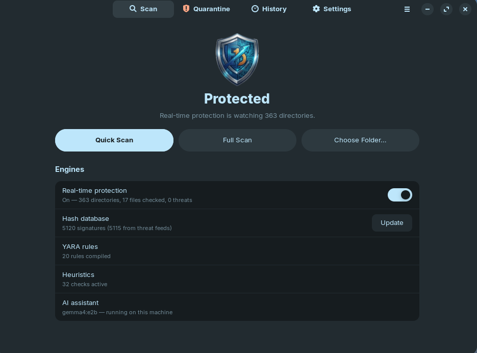
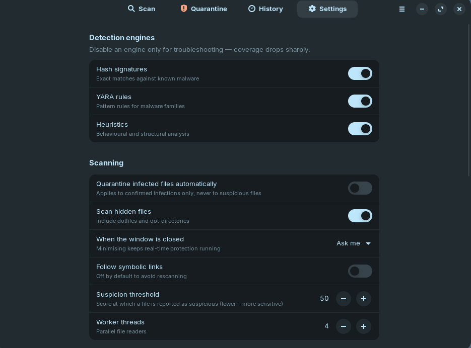
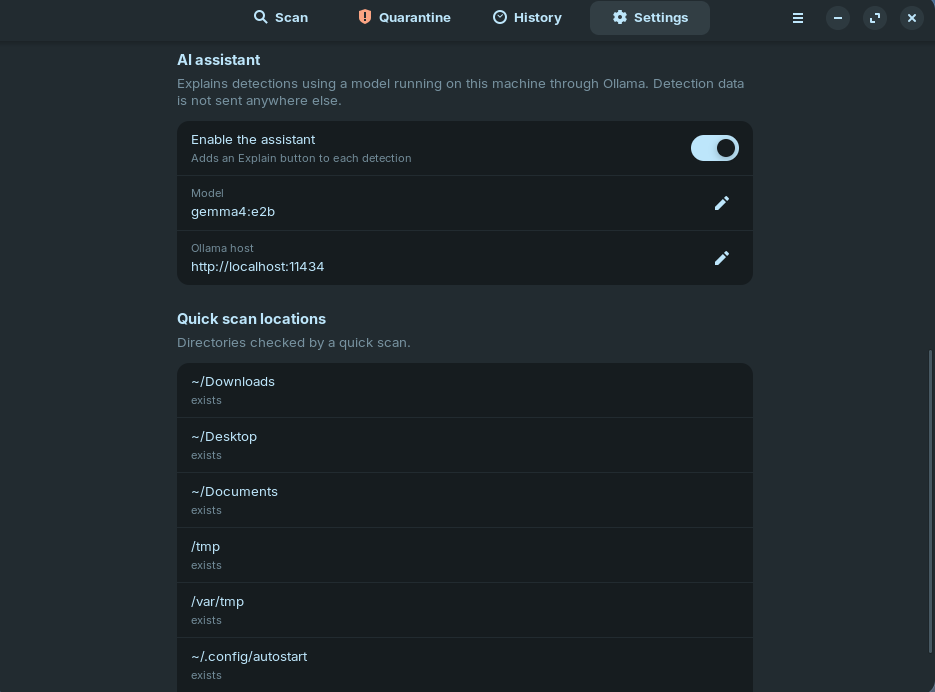
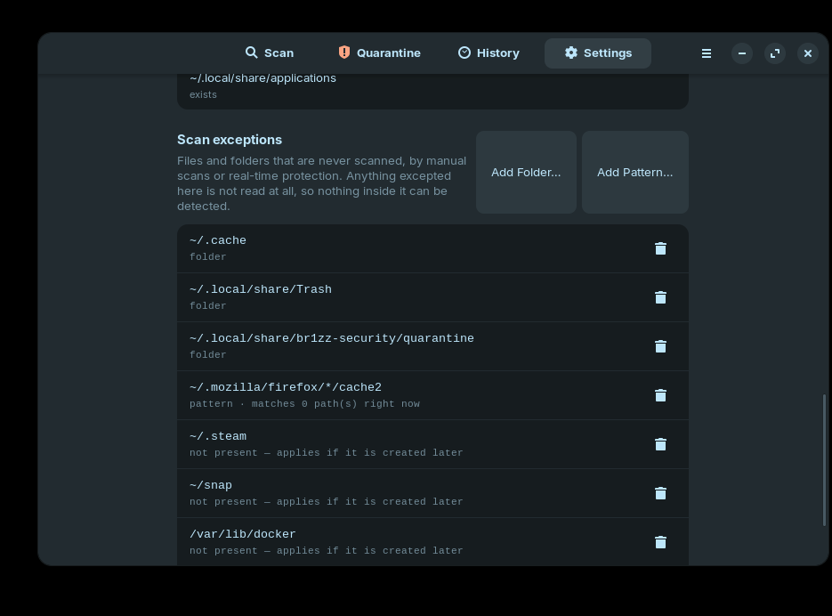

<p align="center">
  
</p>

# Br1zz Security

An on-demand antivirus scanner for Linux, built from scratch in Python. It
combines three independent detection engines, isolates what it finds in a
neutralising quarantine vault, and ships with both a CLI and a GTK4 desktop app.

It runs entirely as your own user. No daemon, no root, no kernel modules,
nothing outside `$HOME`.

## Screenshots

### Main Window
<p align="center">
  
</p>

### Settings & Configuration
<p align="center">
  
</p>

<p align="center">
  
</p>

### Scan Exceptions
<p align="center">
  
</p>

---

## How detection works

Every file is read once and passed to three engines that vote independently.

| Engine | What it catches | Precision |
|---|---|---|
| **Hash signatures** | Exact known-malware samples (SHA-256 / SHA-1 / MD5) | Perfect — a digest either matches or it does not |
| **YARA rules** | Malware families and techniques by pattern | High — 20 rules, most requiring several correlated indicators |
| **Heuristics** | Never-before-seen samples, by structure and behaviour | Scored, never conclusive alone |

### Verdict policy

Detections carry a severity (INFO/LOW/MEDIUM/HIGH/CRITICAL) and are folded into
one score per file. The policy is deliberately conservative, because a false
positive that quarantines a real user file is worse than a missed weak signal:

- **INFECTED** — an exact hash match, or a CRITICAL-severity rule
- **SUSPICIOUS** — score ≥ 50 (configurable)
- **CLEAN** — below that; weak signals are still recorded in the detection list

Two rules follow from this and are enforced in `scanner.py`:

- Heuristics alone can only reach INFECTED on a **CRITICAL** signal. Two HIGH
  heuristics corroborate each other to SUSPICIOUS — they do not add up to a
  conviction.
- Auto-quarantine only ever acts on INFECTED, never on SUSPICIOUS.

### Why the rules look paranoid about false positives

An early revision of this rule set was measured against a real `/usr/bin` and
flagged **28 files** — `git`, `bash`, `systemctl`, `snap`, and most of
`/etc/pam.d`. Every one was a false positive, and the cause was structural:

1. **A compiled binary's string table contains everything.** `bash` genuinely
   contains the strings `/dev/tcp/`, `.bashrc`, and `/etc/ld.so.preload`.
   Behavioural shell rules now gate on an `is_text` external variable and never
   run against ELF objects.
2. **Co-occurrence proves nothing.** Two strings appearing somewhere in a
   20,000-line script is not evidence. Correlating rules now require their
   indicators within a few hundred bytes of each other, using YARA's `@offset`
   operator — which is what "part of the same statement" actually means.
3. **Naming a path is not touching it.** `/etc/pam.d/*` mentions `/etc/shadow`;
   `ssh-copy-id` appends to `authorized_keys`. Rules require an *action* against
   the sensitive file, not a reference to it.

Measured on this machine (Zorin OS 18.1), across `/usr/bin`, `/usr/sbin`,
`/usr/lib`, `/usr/share`, `/etc` and `/opt`:

```
Detection:        19 / 19 malware families flagged      (0 missed)
False positives:  72 / 185,367 system files             (0.039%)
Volume:           185,367 files / 20.1 GB
```

An earlier revision of this table claimed 0.000%, measured over 5,636 files.
That number was real but the sample was too narrow — it excluded `/usr/share`
and most of `/usr/lib`. Measured against the whole system the first honest
figure was **0.18%** (334 files), which the fixes below cut to 0.039%:

- Encoding indicators (long base64, hex blobs, `String.fromCharCode` chains)
  fired on SVG icons, TLS certificates and minified JavaScript. They are now
  `LOW` — they corroborate, they cannot convict alone.
- Single miner keywords matched `XMriG`, a CUPS **printer model**, and
  `randomx`, a package name in `lto-disabled-list`. The heuristic now needs a
  pool URL or `--donate-level`.
- **YARA scan failures were being emitted as detections**, so an engine timeout
  triggered the "two engines agree" boost and pushed clean files to SUSPICIOUS.
  Errors are diagnostics now, never evidence.

The remaining ~0.04% is mostly documentation: `.md` files, READMEs and install
guides that *describe* `curl … | sh`. Prose about a command is being read as a
script that runs one. Scoping the behavioural rules to actual scripts — the same
move that fixed binaries — is the next step.

The regression tests in `tests/test_br1zz_security.py::FalsePositiveTests` lock in each
of these historical false positives, using the real files that caused them, so
they cannot come back.

### Why the rules are split into `any/` and `text/`

`br1zz_security/rules/` has two subdirectories, and the split is a performance contract
rather than filing:

- `any/` — matched against **every** file. Literal strings and fixed byte
  patterns only, no regular expressions.
- `text/` — matched only against text and scripts. This is where the
  regex-heavy shell, webshell and persistence rules live.

The reason is that **YARA scans a buffer for every string in a ruleset before it
evaluates a single condition.** An earlier version gated text-only rules with
`is_text` inside their conditions, which reads correctly but does nothing for
cost: every 8 MB shared library still paid to be searched for shell regexes it
could never match. Measured over 836 MB of `/usr/lib`:

```
one combined ruleset      13.0 MB/s
split rulesets            96.0 MB/s      (7.4x)
hash + heuristics only   129.6 MB/s      (the ceiling without YARA)
raw read + hash floor    222.8 MB/s
```

`/usr/lib` alone is 8 GB across 41,000 files on this machine, so that difference
is the one between a full scan finishing and a full scan being abandoned.
`YaraScopeTests` enforces the contract: it fails the build if a regular
expression appears in an `any/` rule, and checks that text rules genuinely do
not run against binaries.

Custom rules dropped in `~/.config/br1zz-security/rules/` default to the `any` scope so
they just work; put regex-heavy ones in `~/.config/br1zz-security/rules/text/`.

---

## Install

```bash
git clone https://github.com/BR1ZB3AR/Br1zzSecurity
cd ~/Br1zzSecurity
./install.sh
```

`install.sh` touches only your home directory: a symlink in `~/.local/bin`, a
desktop entry, and systemd **user** units. It never calls `sudo`.

### Dependencies

Python 3.10+ is the only hard requirement — the scanner runs on the standard
library alone. Two optional packages unlock the rest:

```bash
sudo apt install python3-yara                              # YARA rule engine
sudo apt install python3-gi gir1.2-gtk-4.0 gir1.2-adw-1    # desktop GUI
```

Without `python3-yara` the tool still runs, on hash signatures and heuristics
only, and says so in `br1zz-security status`.

> **Note on virtualenvs:** don't use one. This system's Python is
> `EXTERNALLY-MANAGED` (PEP 668) and has no `pip`, and the GTK bindings (`gi`)
> are system packages that a venv cannot see. Br1zz is written to run on the
> system interpreter for exactly this reason.

---

## Usage

```bash
br1zz-security selftest                    # verify every engine with harmless samples
br1zz-security status                      # engine, quarantine, and last-scan status

br1zz-security scan ~/Downloads            # scan a path
br1zz-security scan --quick                # scan the usual risk areas
br1zz-security scan --full                 # scan the whole filesystem
br1zz-security scan ~/Downloads --json     # machine-readable output
br1zz-security scan --full --quarantine    # isolate infected files as they are found

br1zz-security quarantine list             # what is isolated
br1zz-security quarantine restore <id>     # put a file back, verifying its hash
br1zz-security quarantine delete <id>      # destroy it permanently
br1zz-security history                     # recent scans

br1zz-security explain ~/Downloads/x.sh    # ask the local AI assistant why it was flagged
br1zz-security gui                         # desktop app
```

Exit codes follow the antivirus convention: `0` clean, `1` threats found,
`2` error — so it drops straight into a pipeline.

`Ctrl-C` cancels a scan cleanly; queued work drains immediately rather than
running to completion.

### Desktop app

`br1zz-security gui`, or launch **Br1zz Security** from your applications menu. Scan,
quarantine, history, and settings, with scanning on a worker thread so the
window stays responsive through a full-filesystem scan.

### Scheduled scans

```bash
systemctl --user enable --now br1zz-scan.timer   # daily quick scan
systemctl --user list-timers br1zz-scan.timer
```

The unit runs at `Nice=15` with idle CPU and I/O scheduling, so it never
competes with interactive work.

---

## The AI assistant

A scanner that says `HEUR:ReverseShell.DevTcp` has told you a rule name, not what
happened to your computer. The assistant answers the question that actually
follows — *why was this flagged, how bad is it, and what should I do?*

```bash
br1zz-security explain ~/Downloads/update.sh
```

In the GUI, every detection gets an **Explain** button.

It answers in four fixed sections: what the file appears to be, why it was
flagged, **how likely this is a false alarm**, and what to do. That third
section is not decoration — these rules detect techniques that administration
scripts and developer tooling use legitimately, and the assistant is prompted to
say so when the file looks like one of those.

### It runs on your machine

The assistant talks to [Ollama](https://ollama.com) on `localhost`. Detection
data describes your files, so none of it is sent anywhere:

```bash
ollama serve                  # start the model host
ollama pull llama3.2:3b       # ~2 GB, plenty for this task
```

Any Ollama model works — `assistant_model` is passed straight through, and
`resolve_model()` also matches by family, so `gemma4` finds an installed
`gemma4:e2b`. Verified on this machine:

| model | download | time to explain one detection (CPU) |
|---|---|---|
| `gemma4:e2b` | 7.2 GB | ~19 s warm, ~49 s cold |
| `llama3.2:3b` | ~2 GB | faster, shorter answers |

Larger models write better explanations but you wait longer, and on CPU-only
machines that gap is wide. Set the generation budget with `assistant_max_tokens`
(default 1400 — 700 truncated Gemma mid-section).

Then `br1zz-security status` reports what it will use:

```
AI assistant     ready  llama3.2:3b (on-device)
```

Three honesty details, because "the AI is local" should be something you can
check rather than trust:

- **Ollama `:cloud` tags are proxies, and Br1zz refuses them by default.** They
  are served by your local Ollama daemon but answer off-machine. Br1zz detects
  them, labels them `cloud-routed` rather than quietly calling them local, and
  **blocks the request before sending anything**. A privacy guarantee that is
  announced but not enforced is not a guarantee. Opt in deliberately if you want
  one:

  ```bash
  br1zz-security config set assistant_allow_cloud_model true
  ```

- **Pointing `assistant_host` at another machine is allowed but labelled** —
  the status line reads `remote host`.
- **Only text files contribute an excerpt**, capped at 1.5 KB. A binary's bytes
  are never put in a prompt, and `--no-content` sends detection metadata only.

The assistant is **advisory and cannot act**. It has no access to quarantine,
restore or delete — it proposes, you decide. That boundary is structural: the
explainer is handed a verdict and returns text, and is wired to nothing else.

```bash
br1zz-security config set assistant_enabled false     # turn it off entirely
br1zz-security config set assistant_model qwen2.5:3b  # use a different local model
```

If Ollama is not running the rest of Br1zz is completely unaffected; `explain`
tells you the command to fix it and every other command carries on.

## Real-time protection

Watches your folders and scans files the moment they land.

```bash
br1zz-security watch                      # foreground, Ctrl-C to stop
br1zz-security watch ~/Downloads          # specific directories
br1zz-security watch --quarantine         # isolate infections as they appear
br1zz-security watch --json               # one JSON object per detection

systemctl --user enable --now br1zz-realtime.service   # always on
```

In the GUI it is the first switch under **Engines**; the hero reads *Protected*
while it runs, and the row shows a live count of directories watched, files
checked and threats found. Detections raise a desktop notification.

### What it does and does not do

This is **post-hoc detection**: a file is scanned right after it is written or
moved in, not intercepted before it can be opened. Blocking at `open()` needs
fanotify with `CAP_SYS_ADMIN` — running as root, with a system-wide I/O stall if
the scanner ever hangs. Watching and reacting keeps the whole tool unprivileged,
which is the trade this design makes deliberately.

Implementation notes:

- **inotify via ctypes**, so real-time protection adds no dependencies.
- It watches `IN_CLOSE_WRITE` and `IN_MOVED_TO`, not `IN_CREATE`. A create event
  fires on an empty file the instant it appears, before any content exists;
  close-write means the writer has finished.
- **New subdirectories are picked up automatically**, and swept once on arrival,
  because files can land inside before the watch is installed.
- Repeated writes to the same path within a second are collapsed — editors and
  browsers routinely emit several close-writes per save.
- If the kernel queue overflows, that is reported rather than hidden: files
  written during the gap were genuinely missed.
- Auto-quarantine, when on, applies only to INFECTED verdicts — the same policy
  as on-demand scanning.

Watch limits are per-user and finite. Watching very large trees can exhaust
them, and the error says exactly how to raise it:

```bash
sudo sysctl fs.inotify.max_user_watches=524288
```

### Running in the background

With protection on, closing the window hides it and keeps watching rather than
silently dropping protection; launching the app again brings the window back.
Turn protection off to exit fully, or use **Quit** from the menu.

A tray icon is used when `AyatanaAppIndicator3` bindings are installed:

```bash
sudo apt install gir1.2-ayatanaappindicator3-0.1
```

Without them the app simply runs without a tray icon — background protection is
unaffected.

## Br1zz Security excludes its own files

The scanner never scans its own installation. `_excluded_roots()` covers:

| Path | Why |
|---|---|
| the checkout / install root | the YARA rules and the test suite carry malware patterns and live EICAR samples *by design* |
| `~/.local/share/br1zz-security` | quarantine vault, signature database, scan history |
| `~/.config/br1zz-security` | settings and user rules |

Without this the tool reliably detects itself, and real (or test) findings drown
in the noise. The real-time watcher shares the same exclusion list — watching the
quarantine vault would otherwise re-detect every file the instant it was
isolated.

Roots are resolved to absolute paths before the exclusion check. A relative root
(`br1zz-security scan .`) produces relative entry paths whose parents can never
match an absolute exclusion, which silently defeated self-exclusion until it was
fixed.

The trade-off is honest: malware planted *inside* the installation directory
would not be scanned. Self-exclusion is standard for antivirus software, and the
alternative is a permanent flood of self-detections.

## The scan exception list

Anything on the exception list is never walked, never read and never scanned —
by manual scans and by real-time protection alike. Manage it in
**Settings → Scan exceptions**:

- **Add Folder…** picks a directory with the file chooser
- **Add Pattern…** takes a path or a glob, e.g. `~/Projects/*/node_modules`
- the trash icon on any row removes that exception
- **Except**, on a detection row in the scan results, adds the flagged file
  itself — the moment you actually decide something is a false positive

Entries are stored in `excludes` in `config.json`, alongside the shipped
defaults (`~/.cache`, `/var/log`, `~/.steam`, …).

### What the list does and does not do

An exception suppresses the file, not the rule. The YARA rule or heuristic that
fired still protects every other file — which is why this is the right tool for
"this one file is fine" and the wrong one for "this rule is too noisy". Because
an excepted path is never read at all, no *future* change to it can be detected
either; excepting a file you do not control is how you build a blind spot.

Two rules keep the list honest:

- **`/` and your home directory are refused.** Both "work", and both silently
  reduce every later scan to zero files while still reporting success.
- **Redundant entries are refused.** Adding `/opt/vendor/lib/x.so` when
  `/opt/vendor` is already excepted is rejected rather than appended, so the
  list stays short enough to actually audit.

Paths are stored with a leading `~` rather than an expanded home directory, so a
config file survives being copied to another machine. Globs are re-expanded on
every scan, so an exception for `~/Projects/*/node_modules` covers projects
created after it was added.

The exception list applies to real-time protection immediately, without
restarting it. Exclusion is re-checked per file event rather than trusted from
the moment a directory was watched — a directory already under watch when you
add an exception for it stays under watch, so checking only at watch time would
leave the new exception silently ineffective until the next restart.

## Quarantine

Quarantined files are **neutralised, not just moved**:

- content is XOR-encoded with a per-file 32-byte random key before it is written
  to the vault, so the stored copy is not a runnable executable and will not
  trip other scanners
- the vault copy is mode `0600` with every execute bit stripped
- the vault directory itself is `0700`
- restoring verifies the decoded content against the SHA-256 recorded at capture
  time and refuses if it does not match
- deleting overwrites the bytes with random data before unlinking

Everything lives in `~/.local/share/br1zz-security/`, and the vault is excluded from
scanning (as is the package's own `rules/` directory, which is full of malware
patterns by definition).

---

## Extending it

### Updating the signature database

The bundled database holds only the EICAR test signatures. Real coverage comes
from public threat-intelligence feeds:

```bash
br1zz-security update              # fetch the latest signatures
br1zz-security update --list       # show feeds, URLs, and when each was last updated
br1zz-security update --full       # the complete corpus instead of the recent window (~42 MB)
br1zz-security update --dry-run    # show exactly which hosts would be contacted
br1zz-security update --clear      # drop all feed-sourced signatures
```

In the GUI, the **Update** button sits on the Hash database row; it fetches on a
worker thread and reloads the database in place, so the next scan uses the new
signatures without a restart.

The default feed is [abuse.ch MalwareBazaar](https://bazaar.abuse.ch/) — no API
key, no account. The recent window is ~1,500 samples (about 4,700 hashes across
SHA-256/SHA-1/MD5) and downloads in well under a second.

Three implementation notes:

- **Feed hashes go into SQLite, not JSON.** The full corpus is over a million
  entries; holding that in a Python dict costs hundreds of megabytes and slows
  startup, while an indexed lookup is constant-time and uses almost nothing.
  Connections are per-thread, because the scanner queries this from a thread
  pool and a sqlite3 connection cannot be shared across threads.
- **Nothing is fetched during a scan.** Updates happen only when you ask, and
  `--dry-run` / `--list` print every URL before anything is contacted.
- **The scheduled scan refreshes first.** The systemd unit runs `br1zz-security update`
  as `ExecStartPre=-…`, where the `-` means a network failure does not cancel
  the scan — stale signatures still beat no scan.

Add your own feed in `~/.config/br1zz-security/config.json`:

```json
"signature_feeds": [
  {"name": "my-feed", "url": "https://example.org/hashes.txt",
   "format": "sha256_lines", "enabled": true}
]
```

Formats are `malwarebazaar_csv` and `sha256_lines`; both accept plain text or a
zip. Entries are merged over the built-in list by name, so you can also use this
to disable a default feed.

**Add a hash signature** for a sample you have:

```bash
br1zz-security sig add ./sample.bin --name Trojan.Linux.MyFamily
br1zz-security sig add 275a021bbf... --name Trojan.Linux.MyFamily
```

**Add YARA rules** by dropping `.yar` files into `~/.config/br1zz-security/rules/`. They
are compiled alongside the built-ins, each in its own namespace, so a broken
rule file disables only itself. Use `severity = "critical" | "high" | ...` in
the rule's `meta` to drive the verdict, and gate behavioural rules on the
`is_text` external.

**Change settings** in `~/.config/br1zz-security/config.json`, via `br1zz-security config set`,
or in the GUI's Settings tab:

```bash
br1zz-security config show
br1zz-security config set heuristic_threshold 40
br1zz-security config set auto_quarantine true
```

---

## What this is not

Being straight about the limits:

- **No real-time protection.** This is an on-demand scanner by design. Nothing
  is intercepted at open() time; a file is only examined when you scan it or the
  timer fires.
- **Hash coverage depends on you running `br1zz-security update`.** The bundled database
  is only the EICAR test signatures; MalwareBazaar's recent window is a rolling
  48 hours, and even the full corpus is a fraction of what commercial engines
  see. Enable the timer so it refreshes daily.
- **Unprivileged by design.** It scans what your user can read. Running it as
  root would cover more files but is not the intended posture.
- **Not a substitute for the rest of your defences** — updates, least privilege,
  and backups still do more for you than any scanner.

---

## Development

```bash
python3 -m unittest discover -s tests -v     # 104 tests, standard library only
```

The suite redirects `XDG_DATA_HOME`/`XDG_CONFIG_HOME` to a scratch directory
before importing the package, so it never touches your real quarantine vault.
It passes both with and without `yara-python` installed, and the assistant tests
run against a mock Ollama host — no model, no network, nothing sent anywhere.

### Layout

```
br1zz/
  config.py            XDG paths and settings
  cli.py               command-line interface
  quarantine.py        the neutralising vault
  scanlog.py           scan history (JSONL)
  engine/
    verdict.py         Detection / FileVerdict / ScanSummary
    hashdb.py          hash signature matching
    yara_engine.py     YARA wrapper, optional dependency
    heuristics.py      entropy, ELF parsing, behavioural patterns
    scanner.py         traversal, orchestration, verdict policy
  assistant/
    ollama.py          local model client (stdlib urllib)
    explain.py         grounded prompt building, advisory only
  rules/*.yar          built-in YARA rules
  signatures/          built-in hash database
  gui/                 GTK4 / libadwaita desktop app
bin/br1zz              launcher
systemd/               user service + timer
tests/                 test suite
```

## License

This project is licensed under the MIT License - see the [LICENSE](LICENSE) file for details.


